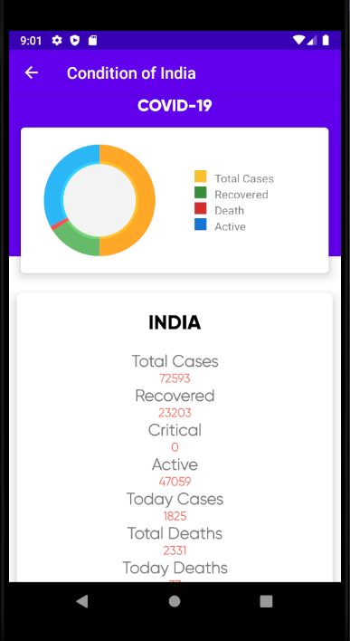

# VirusTracker for COVID-19

With latest CoronaVirus(COVID-19) outbreak, this app helps you to monitor current situation of the outbreak.

## A Java based android app made in Android Studio

</img>
</img> 

## Features
* Uses REST API and Volley library to fetch data
* Provides the global stats of corona virus
* Provides list to select the desired country with a search functionality
* Provides in-depth stats of the selected country
* LIVE stats

</img>
</img> 

## Data Source
* https://corona.lmao.ninja/ It is programmatically retrieved using API
* https://www.who.int/emergencies/diseases/novel-coronavirus-2019

## How to run this app?
* git clone the project using url
* Build project by using Gradle
* Run the app, by pressing the run button on your ide
* OR, build as apk to run this application on your device

### Author : Shubhankar Darbari
### License : MIT License
